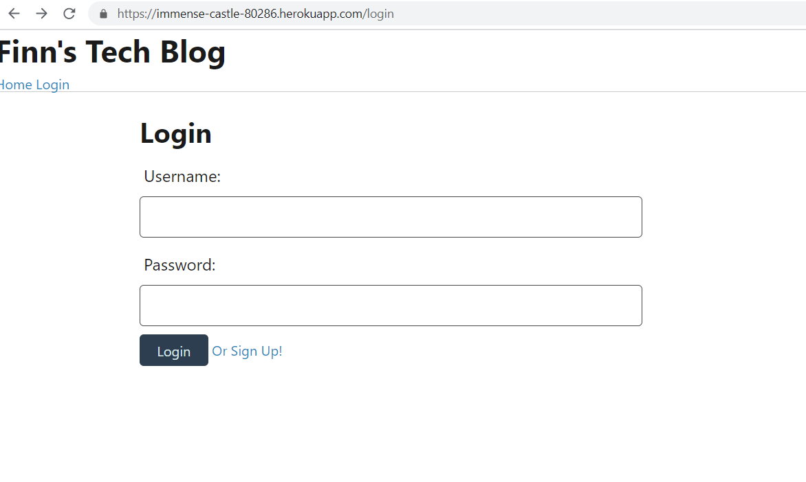

# 14-MVC-Tech-Blog

# Description

I built a CMS-style blog site similar to a Wordpress site, where developers can publish their blog posts and comment on other developers’ posts as well. This site was built completely from scratch and deployed to Heroku. This app follows the MVC paradigm in its architectural structure, using Handlebars.js as the templating language, Sequelize as the ORM, and the express-session npm package for authentication.

# Table of Contents
1. [Title](Title)
2. [Description](#description)
3. [Installation](#installation)
4. [Contributing](#contribution)
5. [Questions](#questions)
6. [License](#license)
7. [Demo](#Demo)
8. [Screenshot](#screenshot)
# Installation 
I used 'npm i' to insall all required pacakages.
# Contribution
Myself
# Questions
## GitHub 
 Lyndseyfin
## Email 
 lyndseyfinamore@gmail.com
## License

## Heroku
<a href="https://immense-castle-80286.herokuapp.com/">Finn's Tech Blog</a>
## Screenshot

